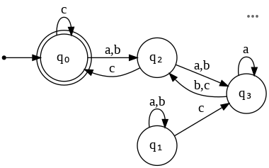
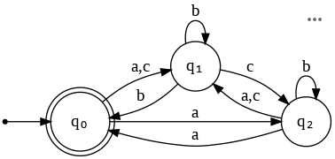

# TPC 2
## Autómatos

### Pergunta 1
A palavra aabbcc é aceite pelo autómato finito determinístico (DFA) abaixo?

R: Verdadeiro

### Pergunta 2
A palavra ababab é aceite pelo autómato finito não-determinístico (NFA) abaixo?

R: Verdadeiro
